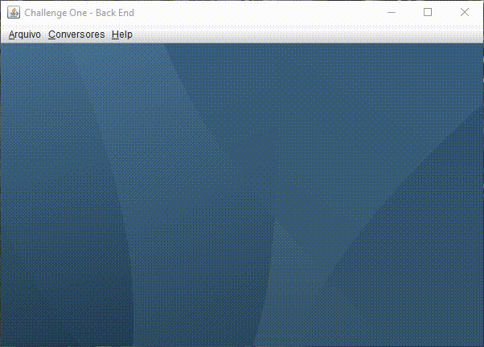
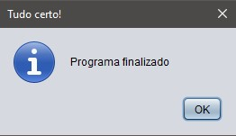

# Challenge One Back-End Conversor

Um projeto para pôr em prática e aprender mais da linguagem java, projetando um
programa de conversão.

## Instruções para uso do repositório

  <ol>
    <li>Faça download do .zip do projeto 
        <a href="https://github.com/FilipeRobot/Challenge-One-Back-End-Conversor/archive/refs/heads/master.zip" target="_blank">aqui</a>
        ou no botão "Code" do Github e depois em "Download zip",
         
        ou você pode fazer um fork do projeto ;)
    </li>
    <li>Descompacte o zip em algum lugar da sua maquina</li>
    <li>Use sua IDE de preferencia para importar o projeto</li>
    <li>Aperte em "run" (rodar)</li>
</ol>

## Demostração do projeto

   

        
    

    
Depois de confirmar que deseja finalizar a aplicação

    

